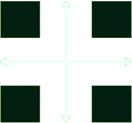

  

<h1 align="center">Site Eklesia Kerigma</h1>

---

### ✨ Sobre o projeto

Este site foi desenvolvido com o propósito de ampliar a visibilidade da **Eklesia Kerigma**, um ministério cristão liderado por um pastor brasileiro e sua esposa, atualmente em missão no Paraguai.

A plataforma foi planejada estrategicamente para:

- Apresentar a missão, visão e valores do ministério;
- Inspirar e engajar novos membros, voluntários e parceiros;
- Divulgar eventos, ações missionárias, testemunhos de fé e conteúdos edificantes;
- Servir como ponte de comunicação com apoiadores e comunidades atendidas na América Latina.

Com uma interface clara, responsiva e centrada na experiência do usuário, o site busca fortalecer a presença digital da **Eklesia Kerigma** e contribuir para a expansão do seu impacto missionário.

---

### 🛠️ Tecnologias e ferramentas utilizadas

- **HTML5 & CSS3** – Estrutura e estilização das páginas
- **JavaScript (Vanilla)** – Interatividade e lógica de comportamento
- **AOS (Animate On Scroll)** – Animações de entrada ao rolar a página
- **Google Maps Embed API** – Exibição de localização diretamente no site
- **WhatsApp API (click-to-chat)** – Contato direto via WhatsApp
- **Netlify** – Hospedagem e deploy contínuo
- **Netlify.toml** – Configuração personalizada para redirecionamento e remoção de `.html` das URLs

---

### 📌 Observações

Caso deseje contribuir com o projeto, relatar bugs ou sugerir melhorias, sinta-se à vontade para abrir uma issue ou pull request.

---

### 🙏 Agradecimentos

Agradeço a todos irmãos em Cristo que apoiam e tornam este projeto possível.

> "Ide por todo o mundo, pregai o evangelho a toda criatura." — *Marcos 16:15*
